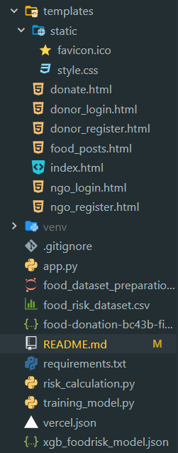

# FoodShare
We bridge the gap between waste and want. Our platform connects local businesses with surplus food to organizations that serve those in need.

## Deployed Link
[Visit Application](https://foodshare-donation.onrender.com)

## File Structure

## Setup

### 1. Create a Virtual Environment

#### 🪟 Windows (CMD or PowerShell)
>python -m venv venv  
venv\Scripts\activate

#### 🍎 macOS / 🐧 Linux
>python3 -m venv venv  
source venv/bin/activate

### 2. Install Dependencies
>pip install -r requirements.txt

### 3. Run the Application
>python app.py

